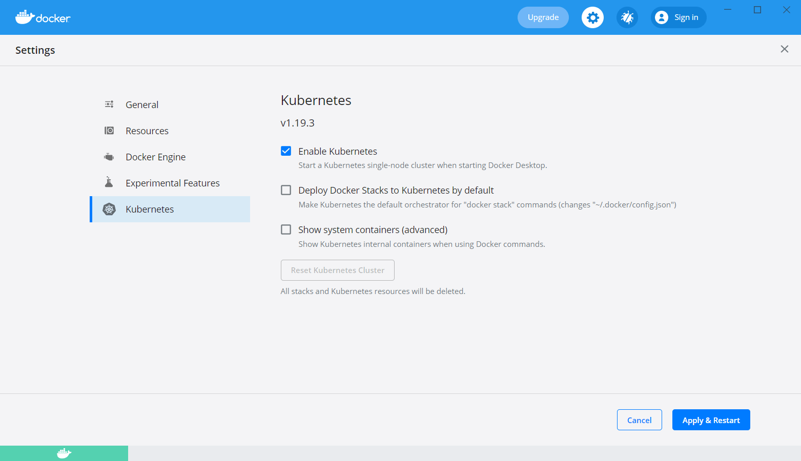

## Local Development Stack

local-stack is a collection of tools that help develop and test UptimeLabs on a local machine.

- [Local Development Stack](#local-development-stack)
- [Before you begin](#before-you-begin)
  - [Prerequisites](#prerequisites)
  - [Optional dependencies](#optional-dependencies)
- [1. Installation](#1-installation)
  - [1.1 Download the latest release](#11-download-the-latest-release)
    - [Linux](#linux)
    - [MacOS](#macos)
  - [1.2 Create a configuration file](#12-create-a-configuration-file)
  - [1.3 Copy overrides directory to your home directory](#13-copy-overrides-directory-to-your-home-directory)
  - [1.4 Login to the teleport server](#14-login-to-the-teleport-server)
- [2. Creating a local Kubernetes cluster](#2-creating-a-local-kubernetes-cluster)
  - [2.1 Kind cluster - if you have docker desktop, skip to step 1.2](#21-kind-cluster---if-you-have-docker-desktop-skip-to-step-12)
  - [2.2 Enable Kubernetes cluster in Docker Desktop](#22-enable-kubernetes-cluster-in-docker-desktop)
  - [2.3 Install metallb and configure for kind cluster (skip if you are using docker desktop)](#23-install-metallb-and-configure-for-kind-cluster-skip-if-you-are-using-docker-desktop)
- [3. Installing Packages and Services](#3-installing-packages-and-services)
- [4. Configuration](#4-configuration)
  - [4.1 Configure helm repositories](#41-configure-helm-repositories)
  - [4.2 Configure ECR credentials](#42-configure-ecr-credentials)
- [5. Setting up the local environment](#5-setting-up-the-local-environment)
  - [5.1 Install uptimelabs configuration package](#51-install-uptimelabs-configuration-package)
  - [5.2 Install mysql, keycloak and mosquitto](#52-install-mysql-keycloak-and-mosquitto)
    - [5.2.1 Import mysql database](#521-import-mysql-database)
    - [5.2.2 Import keycloak realm](#522-import-keycloak-realm)
  - [5.3 Install rest of the packages](#53-install-rest-of-the-packages)
  - [5.4 Removing packages](#54-removing-packages)
- [6. Troubleshooting](#6-troubleshooting)


## Before you begin

### Prerequisites

Kubernetes in Docker (kind) is a tool for running local Kubernetes clusters using Docker container "nodes".
Install Docker on your local machine. You will need Docker in order to use kind.

- Docker Desktop
- kubectl
- mysql-client
- awscli
- WSL2 - if you are using Windows

Read more about installing the dependencies [here](docs/dependencies.md)

### Optional dependencies
- kind v0.17.0 or later - We recommend using `Kind` if you are on GNU-Linux.

---
## 1. Installation

### 1.1 Download the latest release

Download the latest release from the [releases page](https://github.com/uptime-labs/local-stack/releases).

Make sure to download the correct version for your operating system.
 - `upctl_0.x.x_linux_amd64` for Intel-based GNU/Linux
 - `upctl_0.x.x_linux_arm64` for Arm-based GNU/Linux
 - `upctl_0.x.x_darwin_amd64` for intel-based macOS
 - `upctl_0.x.x_darwin_arm64` for Arm-based macOS

#### Linux

```bash
$ cd ~/Downloads
$ sudo install -o root -g root -m 0755 upctl_0.7.0_linux_amd64 /usr/local/bin/upctl
```

#### MacOS

```bash
$ cd ~/Downloads
$ chmod +x upctl_0.7.0_darwin_amd64
$ sudo mv upctl_0.7.0_darwin_amd64 /usr/local/bin/upctl
```

### 1.2 Create a configuration file

- Copy the sample configuration file `.upctl.yaml` from the root of the project to your home directory.

```bash
$ cp .upctl.yaml ~/.upctl.yaml
```

- Update the configuration file for your environment.

Obtain helm UptimeLabs private repository credentials from the UptimeLabs team and add them to the `.upctl.yaml` file.

```yaml
repositories:
  - name: uptimelabs
    url: https://uptime-labs.github.io/helm-charts
    username: <username>
    password: <password>
```

### 1.3 Copy overrides directory to your home directory

```bash
$ mkdir ~/.upctl
$ cp -R overrides ~/.upctl/
```

update the overrides property in the `.upctl.yaml` file to point to the overrides directory in your home directory.

### 1.4 Login to the teleport server

```bash
$ tsh login --proxy=teleport.uptimelabs.io:443
```

---

## 2. Creating a local Kubernetes cluster

### 2.1 Kind cluster - if you have docker desktop, skip to step 1.2

```bash
$ kind create cluster --cluster config/kind.config.yaml
```

This command will create a local Kubernetes cluster using Docker containers as the nodes. You can then use kubectl, the Kubernetes command-line interface, to deploy and manage applications on the cluster.

### 2.2 Enable Kubernetes cluster in Docker Desktop

- Open up the settings screen and Navigate to the Kubernetes tab, then check Enable Kubernetes:



### 2.3 Install metallb and configure for kind cluster (skip if you are using docker desktop)

- Read more about metallb [here](https://metallb.universe.tf/)
- Read more about network configuration with metallb [here](docs/network.md)

```bash
$ upctl install metallb
$ kubeclt apply -f config/metallb-config.yaml
```
---
## 3. Installing Packages and Services

We use helm as a package manager to install packages into the Kubernetes clusters. To simplify the management of repositories and the packages the local-stack includes a set of scripts and configuration files.

- **upctl.yaml**

  - `repositories`

    This fie contains a list of required helm repositories to pull helm packages. When you are configuring repositories you can obtain the repository URL from the maintainer usualy from (https://artifacthub.io/) and give any preferred name for the name feild.
    Following is an example of configuring the superset repository, you can give any unique `name` to the name property.

    ```yaml
    - name: superset
      url: https://apache.github.io/superset
    ```

  - `packages`

    This file contains all the packages that required to be installed into the local Kubernetes cluster. To define a installable package there are several properties.

    - `name` - The name of helm package. This will be used as an installation name and the name will be prepended to the Kubernetes resources created by this helm package. You can give any preferred name for this.
    - `repo` - The combination of repo and package names in format `<repo name>/<package name>`. The package name as defined by the helm package maintainer. Repository name is the name given in the `repositories.yaml`.
    - `namespace` - Namespace of the package resources should install into.
    - `override` - Helm value files to override default helm package values.

    Values for each package can be modified using the overrides config files located in the `<root>/overrides` directory.
    
    ```yaml
    - name: mosquitto # package name
      repo: k8shome/mosquitto # hem repository name / chart name
      namespace: uptimelabs # namespace to install the package (this will get automatically created)
      override: mqtt.yaml # helm value file for the configuration override
    ```
---
## 4. Configuration

### 4.1 Configure helm repositories

This command will configure the helm repositories for the local Kubernetes cluster. This is required to pull the helm packages from the helm repositories.

The repositories are configured in the `.upctl.yaml` file. You can add or remove repositories from the file and then run the command to configure the repositories.
for the Uptimelabs private Helm repository you must configure the username and password in the `.upctl.yaml` file.

Execute the following command to configure the helm repositories.

```bash
$ upctl config repo
```

### 4.2 Configure ECR credentials

This command will configure the ECR credentials for the local Kubernetes cluster. This is required to pull the images from the private ECR repository.

```bash
$ upctl config docker
```
---
## 5. Setting up the local environment

### 5.1 Install uptimelabs configuration package

This package contains the configuration for the uptimelabs applications. This package should be installed first.

```bash
$ upctl install uptimelabs-envs
```

### 5.2 Install mysql, keycloak and mosquitto

```bash
$ upctl install mysql
$ upctl install keycloak
$ upctl install mosquitto
```

#### 5.2.1 Import mysql database

```bash
$ upctl import-db
```

#### 5.2.2 Import keycloak realm

To import the keycloak realm navigate to the keycloak admin console and import the realm from the `config/tenants-realm.json` file.

### 5.3 Install rest of the packages

```bash
$ upctl install --all
```

### 5.4 Removing packages

```bash
$ upctl remove <package name>
```

## 6. Troubleshooting

6.1 If mysql installation fails after a previous installation, make sure to delete the mysql persistent volume claim before installing again.

```bash
kubectl delete pvc data-mysql-0 -n mysql
```

6.2 If you are seeing the following error when pulling images from ECR, make sure to configure the ECR credentials.

```log
Failed to pull image "300954903401.dkr.ecr.eu-west-1.amazonaws.com/uptimelabs-slack-events:v0.2.38 ││ ": rpc error: code = Unknown desc = Error response from daemon: failed to resolve reference "300954903401.dkr.ecr.eu-west-1.amazonaws.com/uptimelabs-slack-eve ││ nts:v0.2.38": pulling from host 300954903401.dkr.ecr.eu-west-1.amazonaws.com failed with status code [manifests v0.2.38]: 401 Unauthorized 
```

```bash
$ upctl config docker
```

if that doesn't resolve the issue, check if you have configured the image pull secrets for deployments.
